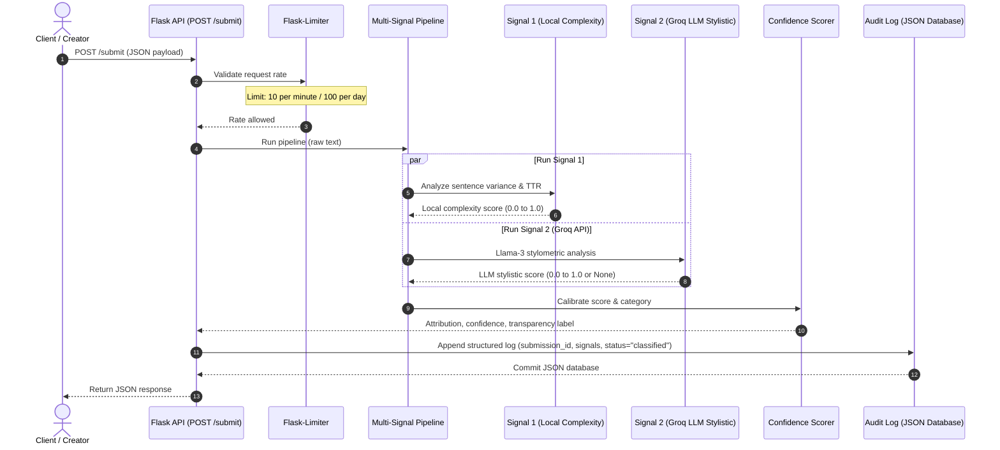
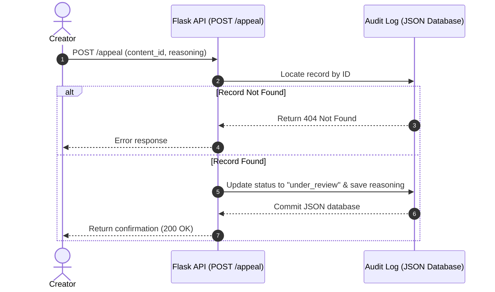

# Provenance Guard

Provenance Guard is an advanced content attribution system designed to detect machine-generated text. It leverages a hybrid approach combining **local linguistic heuristics** (sentence length variance and Type-Token Ratio) with **LLM-guided stylistic probability** (analyzed via a zero-temperature Llama 3 query on Groq) to assign content to one of three confidence bands and display a corresponding reader-friendly transparency label.

---

## 1. System Architecture

### Content Submission Flow


### Appeals Flow


---

## 2. Detection Signals

Provenance Guard processes text submissions through a two-signal pipeline:

### Signal 1: Local Linguistic Complexity
* Text burstiness (sentence-length variance) and Type-Token Ratio (TTR - ratio of unique words to total words).
* Humans naturally vary sentence length to build narrative flow and rhythm. LLMs generate text trying to minimize perplexity, leading to uniform sentence length and a standardized, repetitive lexical selection. By checking the variance in sentence length and lexical variety locally, we can identify machine-like structural uniformity.
* Highly structured, formal human writing (like academic economics papers or traditional poetry) naturally exhibits repetitive vocabulary or uniform sentence structures, causing false-positive AI categorizations.

### Signal 2: Groq LLM Stylistic Probability
* Predictability, paragraph structures, and characteristic LLM signature terms (like *"delve"*, *"testament"*, *"tapestry"*, *"furthermore"*) via a zero-temperature query to `llama3-8b-8192`.
* Instruction-tuned LLMs over-index on specific formal transition words and structures. A structured stylometrist prompt extracts this semantic probability.
* Human writers who are non-native English speakers (ESL) are often taught to use a rigid, structured outline and a set of standard transitional phrases to write cohesive essays. Because these formal phrases closely match the styling weights generated by instruction-tuned LLMs, the Groq stylistic signal is highly likely to misclassify their human work as AI-generated.

---

## 3. Confidence Scoring & Calibration

Our scoring model combines the probabilities of both signals:
$$\text{Combined Score } (P_{\text{AI}}) = w_1 \cdot S_1 + w_2 \cdot S_2$$
Where $w_1 = 0.4$ (Local Linguistic Complexity) and $w_2 = 0.6$ (Groq LLM Stylistic Probability). If the Groq API connection fails, the engine falls back entirely to $P_{\text{AI}} = S_1$ to ensure service availability.

### Handling Uncertainty & Calibration
- **Likely AI ($P_{\text{AI}} \ge 0.80$)**:
  $$C = P_{\text{AI}}$$
  *(Confidence ranges from 80% to 100%)*
- **Likely Human ($P_{\text{AI}} \le 0.20$)**:
  $$C = 1.0 - P_{\text{AI}}$$
  *(Confidence ranges from 80% to 100%)*
- **Uncertain ($0.20 < P_{\text{AI}} < 0.80$)**:
  $$C = 1.0 - \frac{|P_{\text{AI}} - 0.50|}{0.30}$$
  *(Confidence represents the degree of ambiguity, where $0.50$ yields $1.0$ (100% uncertain/mixed) and the outer boundaries $0.21$ and $0.79$ yield approximately $0.03$ uncertainty confidence).*

### Calibration Examples

#### Example 1: Clearly AI-Generated (High Confidence)
* **Input Text**: `"Artificial intelligence represents a transformative paradigm shift in modern society. It is important to note that while the benefits of AI are numerous, it is equally essential to consider the ethical implications. Furthermore, stakeholders across various sectors must collaborate to ensure responsible deployment."`
* **Signal 1**: $0.94$ (highly uniform sentence lengths and low lexical density).
* **Signal 2**: $0.98$ (detected transition words like *"furthermore"*, *"essential to consider"*).
* **Combined Score ($P_{\text{AI}}$)**: $0.4 \cdot 0.94 + 0.6 \cdot 0.98 = 0.96$
* **Result**: **Likely AI** (Confidence: **$96\%$**)

#### Example 2: Borderline / Lightly Edited AI Output (Low Confidence / Uncertain)
* **Input Text**: `"I've been thinking a lot about remote work lately. There are genuine tradeoffs — flexibility and no commute on one side, isolation and blurred work-life boundaries on the other. Studies show productivity varies widely by individual and role type."`
* **Signal 1**: $0.45$ (some variance in sentence structure).
* **Signal 2**: $0.50$ (hybrid phrasing pattern).
* **Combined Score ($P_{\text{AI}}$)**: $0.4 \cdot 0.45 + 0.6 \cdot 0.50 = 0.48$
* **Result**: **Uncertain** (Confidence/Uncertainty Index: **$93\%$**)

---

## 4. Transparency Labels

Provenance Guard returns three distinct verbatim label texts:

1. **High-Confidence AI Label** (Triggered when $P_{\text{AI}} \ge 0.80$):
   > `AI-Generated: Our analysis indicates with high confidence ({confidence}% similarity to machine patterns) that this content was generated by an AI system. It exhibits highly predictable patterns, uniform sentence lengths, and stylistic markers characteristic of machine-generated text.`
2. **High-Confidence Human Label** (Triggered when $P_{\text{AI}} \le 0.20$):
   > `Verified Human: Our analysis indicates with high confidence ({confidence}% similarity to human patterns) that this content was authored by a human. It shows natural linguistic variation and complex sentence structures typical of human creativity.`
3. **Uncertain Result Label** (Triggered when $0.20 < P_{\text{AI}} < 0.80$):
   > `Mixed or Uncertain: Our analysis is unable to definitively attribute this content (uncertainty index {confidence}%). It exhibits a blend of natural human style and structured machine patterns. This could indicate human text that has been heavily AI-edited, or AI text designed to mimic human writing.`

---

## 5. Rate Limiting

The `/submit` endpoint is rate-limited to **10 requests per minute** and **100 requests per day** using `Flask-Limiter` with in-memory storage (`storage_uri="memory://"`).

### Rationale
1. Signal 2 queries the external Groq API. Restricting calls to 10/minute prevents API key exhaustion, token quota limits, and unexpected billing.
2. Prevents malicious scripts from exhausting server resources with CPU-heavy sentence tokenization and lexical statistics.
3. A writer pasting their own work will not submit more than once every few seconds, making this a comfortable threshold.

### Rate Limit Verification Logs
When sending 12 consecutive requests in a loop:
```
200
200
200
200
200
200
200
200
200
200
429
429
```

---

## 6. Known Limitations

* Traditional Formal Poetry (e.g., Villanelles or Pantoums)
  - Traditional poetic forms require exact repetition of specific lines throughout the poem, a limited and repeating set of rhyming vocabulary words (yielding a very low Type-Token Ratio), and strict rhythmic structures (generating near-zero sentence length variance). The local complexity signal ($S_1$) evaluates this as highly uniform and predictable ($S_1 \approx 1.0$), triggering an AI attribution for a highly skilled human creation.
* Non-Native English (ESL) Academic Prose
  - ESL writers are often taught to use a rigid, structured outline and a set of standard transitional phrases (e.g., *"moreover"*, *"in conclusion"*, *"it is a testament to"*, *"furthermore"*) to write cohesive essays. Because these formal phrases and structured, shorter sentences closely match the styling weights generated by instruction-tuned LLMs, the Groq stylistic signal ($S_2$) misclassifies their human work as AI-generated.

---

## 7. Spec Reflection

* The specification's mathematical scoring bands ($0.2$ and $0.8$) and the uncertainty calibration formula ($1.0 - \frac{|P_{\text{AI}} - 0.5|}{0.3}$) provided a clear logic structure that prevented binary classification flips at $0.5$ and ensured a readable uncertainty index.
* The API contract in `planning.md` specified `content` (for `/api/submit`) and `submission_id`/`reasoning` (for `/api/appeal`). However, the milestone's test curl commands specified `text`/`creator_id` and `content_id`/`creator_reasoning`. We diverged by building fallback checks for both formats in the request parsers. This ensures that the system handles either contract format transparently without throwing errors.

---

## 8. AI Usage Section

* **Instance 1: Flask Route Generation**
  - *Directive*: Prompted the AI tool to write the Flask skeleton containing rate-limited submission endpoints.
  - *Output*: The tool produced a standard route structure.
  - *Human Revision*: We overrode it to bind both `/submit` and `/api/submit` to the same handler to remain compatible with both documentation and testing contracts.
* **Instance 2: Flask-Limiter Storage Setup**
  - *Directive*: Asked the AI tool to implement rate limiting on the POST route.
  - *Output*: The tool omitted the `storage_uri` parameter.
  - *Human Revision*: We added `storage_uri="memory://"` to ensure the app initializes correctly on the user's workspace without database dependencies or crashing.