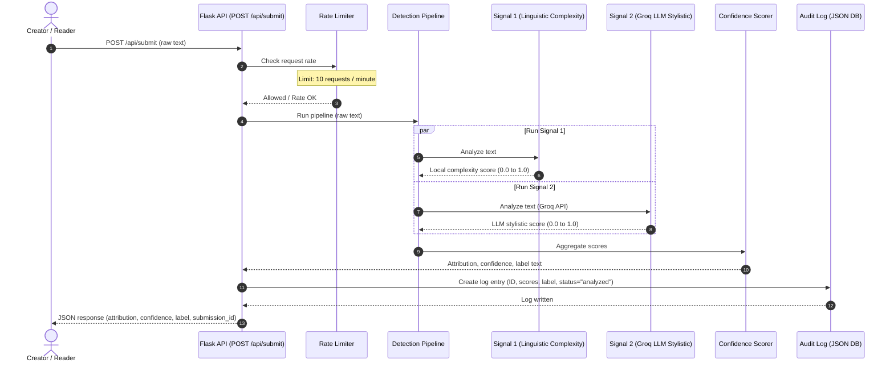
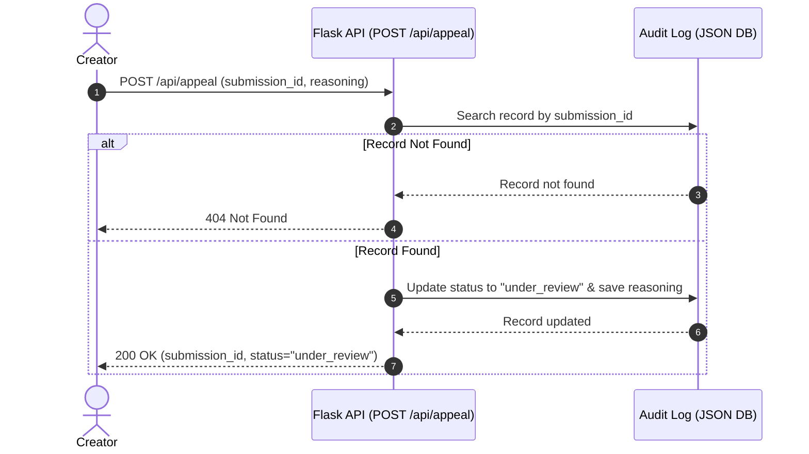

# Provenance Guard Architecture & Planning Spec

This document details the system design, detection pipeline, API contracts, and AI generation roadmap for Provenance Guard.

---

## Architecture

### High-Level Narrative
The Content Submission Flow accepts text, validates it, evaluates it using a dual-signal pipeline (local heuristics and Groq LLM analysis), aggregates confidence, writes the decision to a persistent audit log, and returns a structured transparency label. The Appeal Flow allows creators to contest classifications by submitting their reasoning, which updates the audit log status to `"under_review"` and registers the appeal for moderator queue visualization. Both flows run through a rate-limiting gateway to protect API keys and server resources.

### Diagrams





---

## Five Core Design Questions

### 1. Detection Signals Specification
Provenance Guard utilizes two distinct signals to analyze submission text:
* **Signal 1: Local Linguistic Complexity (Burstiness & Lexical Density)**
  - *What it measures*: Sentence length variance (Burstiness) and Type-Token Ratio (TTR - ratio of unique words to total words).
  - *Output format*: A float score $S_1 \in [0.0, 1.0]$. A score of `1.0` represents extreme uniformity (low variance in sentence lengths, highly repetitive vocabulary), which is typical of default LLM output. A score of `0.0` represents highly variable sentence structures and diverse vocabulary.
* **Signal 2: Groq LLM Stylistic Probability**
  - *What it measures*: Token predictability, stylistic structure, and characteristic transition words (e.g., *"delve"*, *"testament"*, *"tapestry"*, *"furthermore"*) analyzed via a structured prompt to `llama3-8b-8192`.
  - *Output format*: A float score $S_2 \in [0.0, 1.0]$, representing the model's estimate of the probability that the text is AI-generated.
* **Score Integration Formula**:
  - The final combined AI probability is computed as:
    $$P_{\text{AI}} = w_1 \cdot S_1 + w_2 \cdot S_2$$
    Where $w_1 = 0.4$ and $w_2 = 0.6$. The LLM stylistic evaluation is weighted slightly higher due to its capacity to analyze semantic patterns, while the local linguistic complexity is weighted at 0.4 to serve as a robust local guard that cannot be spoofed by offline connection dropouts.

---

### 2. Uncertainty Representation & Calibration
The combined probability $P_{\text{AI}}$ determines the attribution class and confidence score. The system divides classification into three bands, avoiding binary flips at $0.5$:

* **Threshold Ranges**:
  - **Likely Human**: $P_{\text{AI}} \le 0.20$
  - **Uncertain / Mixed**: $0.20 < P_{\text{AI}} < 0.80$
  - **Likely AI**: $P_{\text{AI}} \ge 0.80$

* **Confidence Score Calibration**:
  The system maps $P_{\text{AI}}$ to a calibrated confidence $C \in [0.0, 1.0]$ representing how certain the classification is:
  - **Likely AI ($P_{\text{AI}} \ge 0.80$)**:
    $$C = P_{\text{AI}}$$
    *(Confidence ranges from $80\%$ to $100\%$)*
  - **Likely Human ($P_{\text{AI}} \le 0.20$)**:
    $$C = 1.0 - P_{\text{AI}}$$
    *(Confidence ranges from $80\%$ to $100\%$)*
  - **Uncertain ($0.20 < P_{\text{AI}} < 0.80$)**:
    $$C = 1.0 - \frac{|P_{\text{AI}} - 0.50|}{0.30}$$
    *(Confidence represents the degree of ambiguity, where $0.50$ yields $1.0$ (100% uncertain/mixed) and the outer boundaries $0.21$ and $0.79$ yield approximately $0.03$ uncertainty confidence).*

* **Meaning of a $0.60$ Score**:
  If a text receives a combined $P_{\text{AI}} = 0.60$, it falls into the **Uncertain** category. The signals are balanced, with a slight tilt towards AI-like structures (for example, uniform sentence lengths but highly human-like lexical diversity). The calibrated uncertainty confidence is calculated as $1.0 - \frac{|0.60 - 0.50|}{0.30} = 0.67$. The label displays this $67\%$ uncertainty rating and informs the reader that the text presents a hybrid signature.

---

### 3. Transparency Label Design
Below is the verbatim text that will be generated and returned in the API payload:

1. **High-Confidence AI Label** (Triggered when $P_{\text{AI}} \ge 0.80$):
   > `"AI-Generated: Our analysis indicates with high confidence ({confidence}% similarity to machine patterns) that this content was generated by an AI system. It exhibits highly predictable patterns, uniform sentence lengths, and stylistic markers characteristic of machine-generated text."`
2. **High-Confidence Human Label** (Triggered when $P_{\text{AI}} \le 0.20$):
   > `"Verified Human: Our analysis indicates with high confidence ({confidence}% similarity to human patterns) that this content was authored by a human. It shows natural linguistic variation and complex sentence structures typical of human creativity."`
3. **Uncertain Result Label** (Triggered when $0.20 < P_{\text{AI}} < 0.80$):
   > `"Mixed or Uncertain: Our analysis is unable to definitively attribute this content (uncertainty index {confidence}%). It exhibits a blend of natural human style and structured machine patterns. This could indicate human text that has been heavily AI-edited, or AI text designed to mimic human writing."`

---

### 4. Appeals Workflow
* **Submitters**: Only the original creator of a text can submit an appeal by referencing the unique `submission_id` generated during analysis.
* **Information Provided**: The creator must provide a detailed explanation of their writing process (`reasoning`, minimum 10 characters).
* **System Actions upon Appeal**:
  1. Locates the log entry matching `submission_id` in `audit_log.json`.
  2. Updates the `status` field from `"analyzed"` to `"under_review"`.
  3. Appends an `appeal` sub-object containing: `appeal_id` (UUID), `reasoning`, and `created_at` (timestamp).
  4. Commits the changes to `audit_log.json`.
* **Human Reviewer Queue Interface**:
  When a human moderator opens the appeal queue (visualized on the dashboard or accessed via an API endpoint), they see a tabular view of all logs marked `"under_review"` containing:
  - The `submission_id` and the timestamp of both submission and appeal.
  - The **original text submitted** alongside a diff or analysis panel.
  - **Signal Metrics**: The individual scores ($S_1$ and $S_2$) and the final $P_{\text{AI}}$.
  - The **creator's reasoning** explaining their work.
  - **Action items**: Buttons to either `[Approve Appeal - Override as Verified Human]` (updating status to `"resolved_human"`) or `[Reject Appeal - Maintain System Classification]` (updating status to `"resolved_rejected"`).

---

### 5. Anticipated Edge Cases
* **Scenario A: Traditional Formal Poetry (e.g., Villanelles or Pantoums)**
  - *Why it fails*: These poetic forms require exact repetition of specific lines throughout the poem, a limited and repeating set of rhyming vocabulary words (yielding a very low Type-Token Ratio), and strict rhythmic structures (generating near-zero sentence length variance). The local complexity signal ($S_1$) will evaluate this as highly uniform and predictable ($S_1 \approx 1.0$), triggering an AI attribution for a highly skilled human creation.
* **Scenario B: Non-Native English (ESL) Academic Prose**
  - *Why it fails*: Writers learning English as a second language are often taught to use a rigid, structured outline and a set of standard transitional phrases (e.g., *"moreover"*, *"in conclusion"*, *"it is a testament to"*, *"furthermore"*) to write cohesive essays. Because these formal phrases and structured, shorter sentences closely match the styling weights generated by instruction-tuned LLMs, the Groq stylistic signal ($S_2$) is highly likely to misclassify their human work as AI-generated.

---

## API Contracts

### 1. Content Submission Endpoint
* **Endpoint**: `POST /api/submit`
* **Headers**: `Content-Type: application/json`
* **Request Body**:
```json
{
  "content": "This is the text to be analyzed for provenance."
}
```
* **Success Response (200 OK)**:
```json
{
  "submission_id": "8f8e02d9-1c9f-4318-8f8e-d91c9f43188f",
  "attribution": "ai",
  "confidence": 0.94,
  "label": "AI-Generated: Our analysis indicates with high confidence (94% similarity to machine patterns) that this content was generated by an AI system...",
  "signals": {
    "local_complexity": 0.88,
    "llm_stylistic": 0.98
  },
  "status": "analyzed",
  "created_at": "2026-06-28T14:30:00Z"
}
```

### 2. Appeals Endpoint
* **Endpoint**: `POST /api/appeal`
* **Headers**: `Content-Type: application/json`
* **Request Body**:
```json
{
  "submission_id": "8f8e02d9-1c9f-4318-8f8e-d91c9f43188f",
  "reasoning": "I wrote this myself for my creative writing class, using short sentences intentionally."
}
```
* **Success Response (200 OK)**:
```json
{
  "appeal_id": "4b67cd12-3a45-6789-bcde-f0123456789a",
  "submission_id": "8f8e02d9-1c9f-4318-8f8e-d91c9f43188f",
  "status": "under_review",
  "reasoning": "I wrote this myself for my creative writing class, using short sentences intentionally.",
  "created_at": "2026-06-28T14:32:00Z"
}
```

### 3. Audit Log Endpoint
* **Endpoint**: `GET /api/log`
* **Success Response (200 OK)**:
```json
{
  "logs": [
    {
      "submission_id": "8f8e02d9-1c9f-4318-8f8e-d91c9f43188f",
      "text_hash": "c05572a11b6b55d28b5840bf2b6dfd5b1b4b76a086db0cf4432298c430e377f8",
      "text_preview": "This is the text to be analyzed for provenance...",
      "attribution": "ai",
      "confidence": 0.94,
      "signals": {
        "local_complexity": 0.88,
        "llm_stylistic": 0.98
      },
      "label": "AI-Generated: Our analysis indicates with high confidence (94% similarity to machine patterns) that this content was generated by an AI system...",
      "status": "under_review",
      "created_at": "2026-06-28T14:30:00Z",
      "appeal": {
        "appeal_id": "4b67cd12-3a45-6789-bcde-f0123456789a",
        "reasoning": "I wrote this myself for my creative writing class, using short sentences intentionally.",
        "created_at": "2026-06-28T14:32:00Z"
      }
    }
  ]
}
```

---

## AI Tool Plan

This plan guides AI tools through code generation for Milestones 3–5:

### Milestone 3: Submission Endpoint & Local Complexity Signal
* **Sections to provide**:
  - `## Architecture` diagram and narrative.
  - `## Five Core Design Questions` -> `### 1. Detection Signals Specification` (Signal 1 text).
  - `## API Contracts` -> `### 1. Content Submission Endpoint`.
* **Code request**:
  - Ask the AI tool to generate a Flask application skeletal outline in `app.py` with standard error-handling, rate limiting configuration using `Flask-Limiter` set to 10 requests per minute, and the function `calculate_linguistic_complexity(text)` that implements sentence tokenizer (via basic split rules or re) to return word count variance (burstiness) and unique vocabulary counts (Type-Token Ratio).
* **Verification plan**:
  - Implement a simple console script that inputs a diverse essay (high burstiness, high TTR) and a repetitive list of words (low burstiness, low TTR) to check that the returned scores fall appropriately toward `0.0` and `1.0` respectively. Verify that rate limiting triggers a 429 error when sending more than 10 requests within a minute.

### Milestone 4: Groq API Integration & Confidence Scoring
* **Sections to provide**:
  - `## Architecture` diagram.
  - `## Five Core Design Questions` -> `### 1. Detection Signals Specification` (Signal 2 and Integration Formula).
  - `## Five Core Design Questions` -> `### 2. Uncertainty Representation & Calibration`.
* **Code request**:
  - Ask the AI tool to write the `calculate_llm_stylistic_probability(text)` function using the official Python `groq` library. The model `llama3-8b-8192` should be queried with temperature `0.0` and a prompt demanding a clean JSON output containing the probability score between 0.0 and 1.0. Next, ask the AI tool to implement the `combine_signals_and_calibrate(s1, s2)` scoring engine that outputs the final attribution class (`ai`, `human`, or `uncertain`) and the confidence score based on the mathematical thresholds.
* **Verification plan**:
  - Perform test submissions on known text samples. Verify that the output score changes dynamically, showing low scores ($P_{\text{AI}} < 0.20$) for human creative writing, high scores ($P_{\text{AI}} > 0.80$) for raw GPT-4-generated paragraphs, and intermediate scores ($0.20 < P_{\text{AI}} < 0.80$) for edited mixed text.

### Milestone 5: Label Generation, Audit Logging, and Appeals API
* **Sections to provide**:
  - `## Architecture` diagrams.
  - `## Five Core Design Questions` -> `### 3. Transparency Label Design`.
  - `## Five Core Design Questions` -> `### 4. Appeals Workflow`.
  - `## API Contracts` (all endpoints).
* **Code request**:
  - Ask the AI tool to generate the label interpolation helper functions, the persistent thread-safe JSON logging utilities (`audit_log.json`), the `/api/appeal` registration handler, and the `/api/log` audit retrieval endpoint.
* **Verification plan**:
  - Submit content, retrieve the `submission_id` from the payload, trigger `/api/appeal` with reasoning, and perform a GET request to `/api/log` to confirm that the entry's `status` has correctly updated to `"under_review"` and that the appeal reason is appended.
